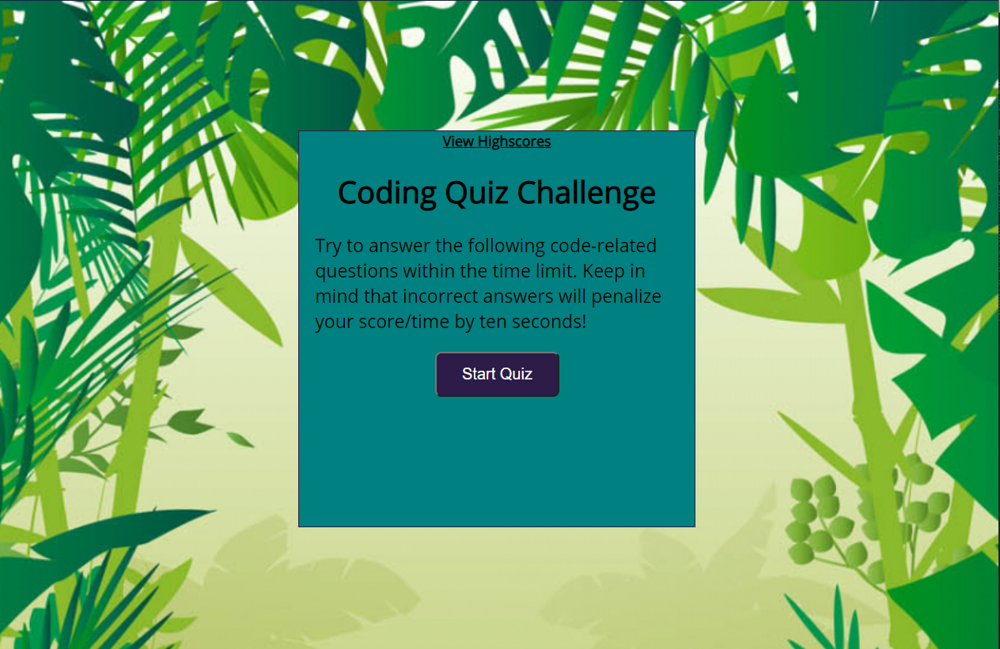

# TimedQuiz

# Purpose

The purpose of this fun(and infomative) quiz is to demostarte JavaScript elements. These elements include several functions, for loops, if/else loops, & various "dot" notations.

When the user selects the correct answer, a message and the next question will appear. If the user selects an incorrect question, time will be reduced fromt he timer and the next question will appear.
After the time has expired or all questions are answered, a final score will be given along with a box to enter the users initals. After this, the user can view the scores and has the option to attempt the quiz again.

# Usage

Click <a href="https://perkyderm.github.io/TimedQuiz/">this link</a> to begin the quiz!

# Note
